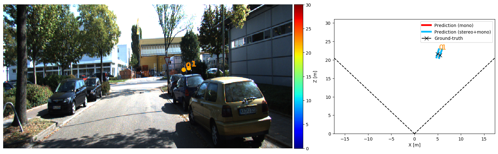
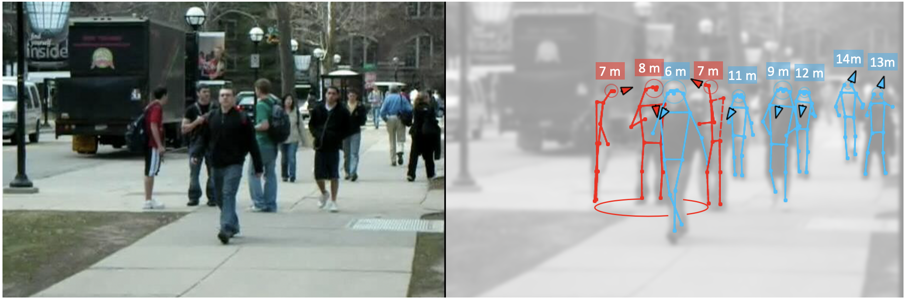
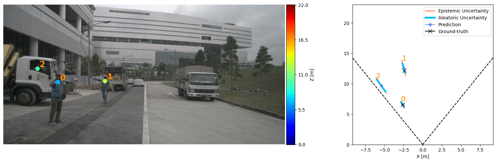

# Perceiving Humans in 3D

This repository contains the code for three research projects:

1. **MonStereo: When Monocular and Stereo Meet at the Tail of 3D Human Localization**   
[README](https://github.com/vita-epfl/monstereo/tree/master/docs/MonStereo.md) & [Article](https://arxiv.org/abs/2008.10913)

    

2.  **Perceiving Humans: from Monocular 3D Localization to Social Distancing**         
 [README](https://github.com/vita-epfl/monstereo/tree/master/docs/SocialDistancing.md) & [Article](https://arxiv.org/abs/2009.00984)
 
    
 
3.  **MonoLoco: Monocular 3D Pedestrian Localization and Uncertainty Estimation**  (Improved!)       
[README](https://github.com/vita-epfl/monstereo/tree/master/docs/MonoLoco.md) & [Article](https://arxiv.org/abs/1906.06059)  & [Original Repo](https://github.com/vita-epfl/monoloco)

    

