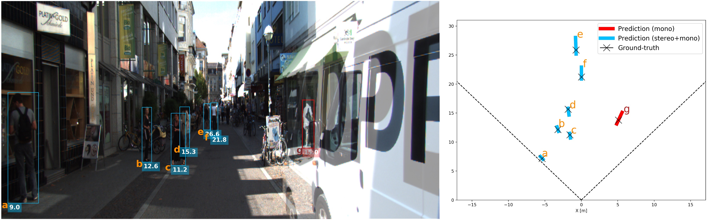

# Perceiving Humans in 3D

This repository contains the code for two research projects:
   
1.  **Perceiving Humans: from Monocular 3D Localization to Social Distancing (MonoLoco++)**         
 [README](https://github.com/vita-epfl/monstereo/blob/master/docs/MonoLoco%2B%2B.md) & [Article](https://arxiv.org/abs/2009.00984)
 
    
 
    
 
 
2.  **MonStereo: When Monocular and Stereo Meet at the Tail of 3D Human Localization**   
[README](https://github.com/vita-epfl/monstereo/blob/master/docs/MonStereo.md) & [Article](https://arxiv.org/abs/2008.10913)
     
     

Both projects has been built upon the CVPR'19 project [Openpifpaf](https://github.com/vita-epfl/openpifpaf) 
for 2D pose estimation and the ICCV'19 project [MonoLoco](https://github.com/vita-epfl/monoloco) for monocular 3D localization. 
All projects share the AGPL Licence.


# Setup
Installation steps are the same for both projects.

### Install
The installation has been tested on OSX and Linux operating systems, with Python 3.6 or Python 3.7. 
Packages have been installed with pip and virtual environments.
For quick installation, do not clone this repository, 
and make sure there is no folder named monstereo in your current directory.
A GPU is not required, yet highly recommended for real-time performances. 
MonStereo can be installed as a package, by:

```
pip3 install monstereo
```

For development of the monstereo source code itself, you need to clone this repository and then:
```
pip3 install sdist
cd monstereo
python3 setup.py sdist bdist_wheel
pip3 install -e .
```

### Interfaces
All the commands are run through a main file called `main.py` using subparsers.
To check all the commands for the parser and the subparsers (including openpifpaf ones) run:

* `python3 -m monstereo.run --help`
* `python3 -m monstereo.run predict --help`
* `python3 -m monstereo.run train --help`
* `python3 -m monstereo.run eval --help`
* `python3 -m monstereo.run prep --help`

or check the file `monstereo/run.py`

### Data structure

    Data         
    ├── arrays                 
    ├── models
    ├── kitti
    ├── figures
    ├── logs
    

Run the following to create the folders:
```
mkdir data
cd data
mkdir arrays models kitti figures logs
```

Further instructions for prediction, preprocessing, training and evaluation can be found here:

* [MonoLoco++ README](https://github.com/vita-epfl/monstereo/blob/master/docs/MonoLoco%2B%2B.md)
* [MonStereo README](https://github.com/vita-epfl/monstereo/blob/master/docs/MonStereo.md)
