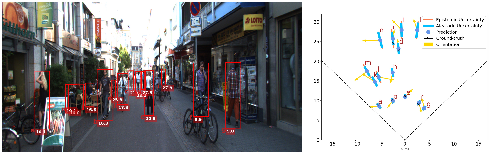
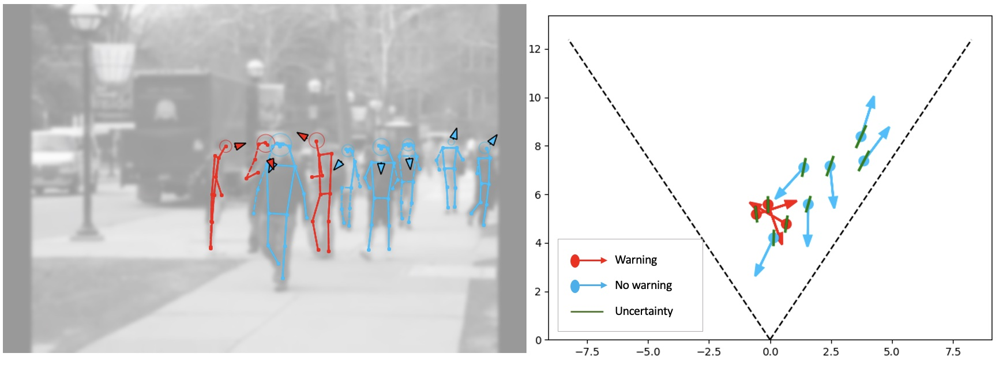

# Monoloco library  &nbsp;&nbsp;  [](https://pepy.tech/project/monoloco)
Continuously tested on Linux, MacOS and Windows: [](https://github.com/vita-epfl/monoloco/actions?query=workflow%3ATests)


This library is based on three research projects for monocular/stereo 3D human localization (detection), body orientation, and social distancing. Check the __video teaser__ of the library on [__YouTube__](https://www.youtube.com/watch?v=O5zhzi8mwJ4). 

---

> __MonStereo: When Monocular and Stereo Meet at the Tail of 3D Human Localization__<br /> 
> _[L. Bertoni](https://scholar.google.com/citations?user=f-4YHeMAAAAJ&hl=en), [S. Kreiss](https://www.svenkreiss.com), 
[T. Mordan](https://people.epfl.ch/taylor.mordan/?lang=en), [A. Alahi](https://scholar.google.com/citations?user=UIhXQ64AAAAJ&hl=en)_, ICRA 2021 <br /> 
__[Article](https://arxiv.org/abs/2008.10913)__  &nbsp; &nbsp; &nbsp; &nbsp; &nbsp; &nbsp; &nbsp; &nbsp;   __[Citation](#Citation)__  &nbsp; &nbsp; &nbsp; &nbsp; &nbsp; &nbsp; &nbsp; &nbsp; __[Video](https://www.youtube.com/watch?v=pGssROjckHU)__
     


---


> __Perceiving Humans: from Monocular 3D Localization to Social Distancing__<br />
> _[L. Bertoni](https://scholar.google.com/citations?user=f-4YHeMAAAAJ&hl=en), [S. Kreiss](https://www.svenkreiss.com), 
[A. Alahi](https://scholar.google.com/citations?user=UIhXQ64AAAAJ&hl=en)_, T-ITS 2021 <br /> 
__[Article](https://arxiv.org/abs/2009.00984)__ &nbsp; &nbsp; &nbsp; &nbsp; &nbsp; &nbsp; &nbsp; &nbsp; __[Citation](#Citation)__ &nbsp; &nbsp; &nbsp; &nbsp; &nbsp;  &nbsp; &nbsp; &nbsp; __[Video](https://www.youtube.com/watch?v=r32UxHFAJ2M)__ 


---

> __MonoLoco: Monocular 3D Pedestrian Localization and Uncertainty Estimation__<br />
> _[L. Bertoni](https://scholar.google.com/citations?user=f-4YHeMAAAAJ&hl=en), [S. Kreiss](https://www.svenkreiss.com), [A.Alahi](https://scholar.google.com/citations?user=UIhXQ64AAAAJ&hl=en)_, ICCV 2019 <br /> 
__[Article](https://arxiv.org/abs/1906.06059)__ &nbsp; &nbsp; &nbsp; &nbsp; &nbsp; &nbsp; &nbsp; &nbsp;    __[Citation](#Citation)__ &nbsp; &nbsp; &nbsp; &nbsp; &nbsp; &nbsp; &nbsp; &nbsp;  __[Video](https://www.youtube.com/watch?v=ii0fqerQrec)__
   

    
## License
All projects are built upon [Openpifpaf](https://github.com/vita-epfl/openpifpaf) for the 2D keypoints and share the AGPL Licence.

This software is also available for commercial licensing via the EPFL Technology Transfer
Office (https://tto.epfl.ch/, info.tto@epfl.ch).


## Quick setup
A GPU is not required, yet highly recommended for real-time performances. 

The installation has been tested on OSX and Linux operating systems, with Python 3.6, 3.7, 3.8. 
Packages have been installed with pip and virtual environments.

For quick installation, do not clone this repository, make sure there is no folder named monoloco in your current directory, and run:

```
pip3 install monoloco
```

For development of the source code itself, you need to clone this repository and then:
```
pip3 install sdist
cd monoloco
python3 setup.py sdist bdist_wheel
pip3 install -e .
```

### Interfaces
All the commands are run through a main file called `run.py` using subparsers.
To check all the options:

* `python3 -m monoloco.run --help`
* `python3 -m monoloco.run predict --help`
* `python3 -m monoloco.run train --help`
* `python3 -m monoloco.run eval --help`
* `python3 -m monoloco.run prep --help`

or check the file `monoloco/run.py`

#  Predictions

The software receives an image (or an entire folder using glob expressions), 
calls PifPaf for 2D human pose detection over the image
and runs Monoloco++ or MonStereo for 3D localization &/or social distancing &/or orientation

**Which Modality** <br /> 
The command `--mode` defines which network to run.

- select `--mode mono` (default) to predict the 3D localization of all the humans from monocular image(s)
- select `--mode stereo` for stereo images
- select `--mode keypoints` if just interested in 2D keypoints from OpenPifPaf

Models are downloaded automatically. To use a specific model, use the command `--model`. Additional models can be downloaded from [here](https://drive.google.com/drive/folders/1jZToVMBEZQMdLB5BAIq2CdCLP5kzNo9t?usp=sharing)

**Which Visualization** <br /> 
- select `--output_types multi` if you want to visualize both frontal view or bird's eye view in the same picture
- select `--output_types bird front` if you want to different pictures for the two views or just one view
- select `--output_types json` if you'd like the ouput json file

If you select `--mode keypoints`, use standard OpenPifPaf arguments

**Focal Length and Camera Parameters** <br /> 
Absolute distances are affected by the camera intrinsic parameters. 
When processing KITTI images, the network uses the provided intrinsic matrix of the dataset. 
In all the other cases, we use the parameters of nuScenes cameras, with "1/1.8'' CMOS sensors of size 7.2 x 5.4 mm.
The default focal length is 5.7mm and this parameter can be modified using the argument `--focal`.

## A) 3D Localization

**Ground-truth comparison** <br /> 
If you provide a ground-truth json file to compare the predictions of the network,
 the script will match every detection using Intersection over Union metric. 
 The ground truth file can be generated using the subparser `prep`, or directly downloaded from [Google Drive](https://drive.google.com/file/d/1e-wXTO460ip_Je2NdXojxrOrJ-Oirlgh/view?usp=sharing) 
 and called it with the command `--path_gt`. 


**Monocular examples** <br>

For an example image, run the following command:

```sh
python -m monoloco.run predict docs/002282.png \
--path_gt names-kitti-200615-1022.json \
-o <output directory> \
--long-edge <rescale the image by providing dimension of long side>
--n_dropout <50 to include epistemic uncertainty, 0 otherwise>
```


To show all the instances estimated by MonoLoco add the argument `--show_all` to the above command.



It is also possible to run [openpifpaf](https://github.com/vita-epfl/openpifpaf) directly
by using `--mode keypoints`. All the other pifpaf arguments are also supported 
and can be checked with `python -m monoloco.run predict --help`.


**Stereo Examples** <br /> 
To run MonStereo on stereo images, make sure the stereo pairs have the following name structure:
- Left image: \<name>.\<extension>
- Right image: \<name>**_r**.\<extension>

(It does not matter the exact suffix as long as the images are ordered)

You can load one or more image pairs using glob expressions. For example:

```sh
python3 -m monoloco.run predict --mode stereo \
--glob docs/000840*.png
 --path_gt <to match results with ground-truths> \
 -o data/output  -long_edge 2500
 ```
 


```sh
python3 -m monoloco.run predict --glob docs/005523*.png \ --output_types multi \
--model data/models/ms-200710-1511.pkl \
--path_gt <to match results with ground-truths> \
-o data/output  --long_edge 2500 \
--instance-threshold 0.05 --seed-threshold 0.05
 ```


## B) Social Distancing (and Talking activity)
To visualize social distancing compliance, simply add the argument `--social-distance` to the predict command. This visualization is not supported with a stereo camera.
Threshold distance and radii (for F-formations) can be set using `--threshold-dist` and `--radii`, respectively.

For more info, run:
`python -m monoloco.run predict --help`

**Examples** <br>
An example from the Collective Activity Dataset is provided below.


To visualize social distancing run the below, command:

```sh
python -m monoloco.run predict docs/frame0032.jpg \
--social_distance --output_types front bird 
```




## C) Orientation and Bounding Box dimensions 
The network estimates orientation and box dimensions as well. Results are saved in a json file when using the command 
`--output_types json`. At the moment, the only visualization including orientation is the social distancing one.
<br /> 

## Training
We train on the KITTI dataset (MonoLoco/Monoloco++/MonStereo) or the nuScenes dataset (MonoLoco) specifying the path of the json file containing the input joints. Please download them [here](https://drive.google.com/drive/folders/1j0riwbS9zuEKQ_3oIs_dWlYBnfuN2WVN?usp=sharing) or follow [preprocessing instructions](#Preprocessing).

Results for [MonoLoco++](###Tables) are obtained with: 

```
python -m monoloco.run train --joints data/arrays/joints-kitti-mono-210422-1600.json
```

While for the [MonStereo](###Tables) results run:

```sh
python -m monoloco.run train --joints data/arrays/joints-kitti-stereo-210422-1601.json --lr 0.003 --mode stereo 
```

If you are interested in the original results of the MonoLoco ICCV article (now improved with MonoLoco++), please refer to the tag v0.4.9 in this repository.

Finally, for a more extensive list of available parameters, run:

`python -m monstereo.run train --help`

<br /> 

## Preprocessing
Preprocessing and training step are already fully supported by the code provided, 
but require first to run a pose detector over
all the training images and collect the annotations. 
The code supports this option (by running the predict script and using `--mode keypoints`).

### Data structure

    data         
    ├── outputs                 
    ├── arrays
    ├── kitti
    
Run the following inside monoloco repository:
```
mkdir data
cd data
mkdir outputs arrays kitti
```


### Kitti Dataset
Download kitti images (from left and right cameras), ground-truth files (labels), and calibration files from their [website](http://www.cvlibs.net/datasets/kitti/eval_object.php?obj_benchmark=3d) and save them inside the `data` folder as shown below.

    data         
    ├── kitti
            ├── gt
            ├── calib
            ├── images
            ├── images_right


The network takes as inputs 2D keypoints annotations. To create them run PifPaf over the saved images:

```sh
python -m openpifpaf.predict \
--glob "data/kitti/images/*.png" \
--json-output <directory to contain predictions> \
--checkpoint=shufflenetv2k30 \
--instance-threshold=0.05 --seed-threshold 0.05 --force-complete-pose 
```

**Horizontal flipping**

To augment the dataset, we apply horizontal flipping on the detected poses. To include small variations in the pose, we use the poses from the right-camera (the dataset uses a stereo camera). As there are no labels for the right camera, the code automatically correct the ground truth depth by taking into account the camera baseline.
To obtain these poses, run pifpaf also on the folder of right images. Make sure to save annotations into a different folder, and call the right folder: `<NameOfTheLeftFolder>_right`

**Recall**

To maximize the recall (at the cost of the computational time), it's possible to upscale the images with the command `--long_edge 2500` (\~scale 2). 

Once this step is complete, the below commands transform all the annotations into a single json file that will used for training.


For MonoLoco++:
```sh
python -m monoloco.run prep --dir_ann <directory that contains annotations>
```

For MonStereo:
```sh
python -m monoloco.run prep --mode stereo --dir_ann <directory that contains left annotations> 
```

### Collective Activity Dataset
To evaluate on of the [collective activity dataset](http://vhosts.eecs.umich.edu/vision//activity-dataset.html)
 (without any training) we selected 6 scenes that contain people talking to each other. 
 This allows for a balanced dataset, but any other configuration will work. 

THe expected structure for the dataset is the following:

    collective_activity         
    ├── images                 
    ├── annotations
    
where images and annotations inside have the following name convention:

IMAGES: seq<sequence_name>_frame<frame_name>.jpg
ANNOTATIONS: seq<sequence_name>_annotations.txt

With respect to the original dataset, the images and annotations are moved to a single folder 
and the sequence is added in their name. One command to do this is:

`rename -v -n 's/frame/seq14_frame/'  f*.jpg`

which for example change the name of all the jpg images in that folder adding the sequence number
 (remove `-n` after checking it works)

Pifpaf annotations should also be saved in a single folder and can be created with:

```sh
python -m openpifpaf.predict \
--glob "data/collective_activity/images/*.jpg"  \
--checkpoint=shufflenetv2k30 \
--instance-threshold=0.05 --seed-threshold 0.05 \--force-complete-pose \
--json-output <output folder>
```


## Evaluation

### 3D Localization
We provide evaluation on KITTI for models trained on nuScenes or KITTI. Download the ground-truths of KITTI dataset and the calibration files from their [website](http://www.cvlibs.net/datasets/kitti/eval_object.php?obj_benchmark=3d). Save the training labels (one .txt file for each image) into the folder `data/kitti/gt` and the camera calibration matrices (one .txt file for each image) into `data/kitti/calib`.  
To evaluate a pre-trained model, download the latest models from [here](https://drive.google.com/drive/u/0/folders/1kQpaTcDsiNyY6eh1kUurcpptfAXkBjAJ) and save them into `data/outputs.

__Baselines__

We compare our results with other monocular 
and stereo baselines, depending whether you are evaluating stereo or monocular settings. For some of the baselines, we have obtained the annotations directly from the authors and we don't have yet the permission to publish them. 

[Mono3D](https://www.cs.toronto.edu/~urtasun/publications/chen_etal_cvpr16.pdf), 
[3DOP](https://xiaozhichen.github.io/papers/nips15chen.pdf), 
[MonoDepth](https://arxiv.org/abs/1609.03677) 
[MonoPSR](https://github.com/kujason/monopsr) and our 
[MonoDIS](https://research.mapillary.com/img/publications/MonoDIS.pdf) and our 
[Geometrical Baseline](monoloco/eval/geom_baseline.py).

* **Mono3D**: download validation files from [here](http://3dimage.ee.tsinghua.edu.cn/cxz/mono3d) 
and save them into `data/kitti/m3d`
* **3DOP**: download validation files from [here](https://xiaozhichen.github.io/) 
and save them into `data/kitti/3dop`
* **MonoDepth**: compute an average depth for every instance using the following script 
[here](https://github.com/Parrotlife/pedestrianDepth-baseline/tree/master/MonoDepth-PyTorch) 
and save them into `data/kitti/monodepth`
* **Geometrical Baseline and MonoLoco**:
To include also geometric baselines and MonoLoco, download a monoloco model, save it in `data/models`, and add the flag ``--baselines`` to the evaluation command


The evaluation file will run the model over all the annotations and compare the results with KITTI  ground-truth and the downloaded baselines. For this run:

```sh
python -m monoloco.run eval \
--dir_ann <annotation directory> \
--model data/outputs/monoloco_pp-210422-1601.pkl \
--generate \
--save \
```

For stereo results add `--mode stereo` and select `--model=monstereo-210422-1620.pkl`.  Below, the resulting table of results and an example of the saved figures.

### Tables


### Relative Average Precision Localization: RALP-5% (MonStereo)

We modified the original C++ evaluation of KITTI to make it relative to distance. We use **cmake**.
To run the evaluation, first generate the txt file with the standard command for evaluation (above).
Then follow the instructions of this [repository](https://github.com/cguindel/eval_kitti) 
to prepare the folders accordingly (or follow kitti guidelines) and run evaluation. 
The modified file is called *evaluate_object.cpp* and runs exactly as the original kitti evaluation.

### Activity Estimation (Talking)
Please follow preprocessing steps for Collective activity dataset and run pifpaf over the dataset images.
Evaluation on this dataset is done with models trained on either KITTI or nuScenes. 
For optimal performances, we suggest the model trained on nuScenes teaser.

```sh
python -m monstereo.run eval \
--activity \
--dataset collective \
--model <path to the model> \
--dir_ann <annotation directory>
```

## Citation
When using this library in your research, we will be happy if you cite us! 

```
@InProceedings{bertoni_2021_icra,
    author = {Bertoni, Lorenzo and Kreiss, Sven and Mordan, Taylor and Alahi, Alexandre},
    title = {MonStereo: When Monocular and Stereo Meet at the Tail of 3D Human Localization},
    booktitle = {the International Conference on Robotics and Automation (ICRA)},
    year = {2021}
}
```

```
@ARTICLE{bertoni_2021_its,
    author = {Bertoni, Lorenzo and Kreiss, Sven and Alahi, Alexandre},
    journal={IEEE Transactions on Intelligent Transportation Systems}, 
    title={Perceiving Humans: from Monocular 3D Localization to Social Distancing}, 
    year={2021},
```

```
@InProceedings{bertoni_2019_iccv,
    author = {Bertoni, Lorenzo and Kreiss, Sven and Alahi, Alexandre},
    title = {MonoLoco: Monocular 3D Pedestrian Localization and Uncertainty Estimation},
    booktitle = {the IEEE International Conference on Computer Vision (ICCV)},
    month = {October},
    year = {2019}
}
```