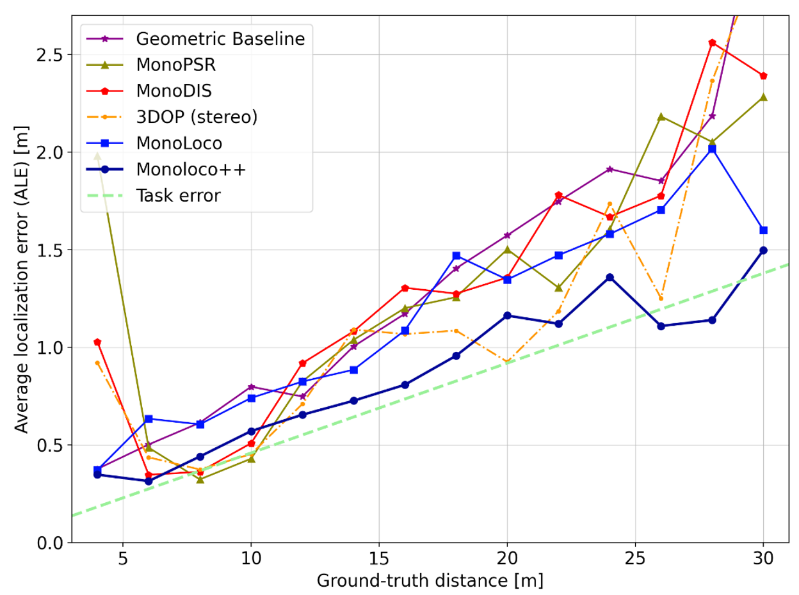

# Monoloco

> We tackle the fundamentally ill-posed problem of 3D human localization from monocular RGB images. 
Driven by the limitation of neural networks outputting point estimates, 
we address the ambiguity in the task with a new neural network  predicting confidence intervals through a 
loss function based on the Laplace distribution. 
Our architecture  is a  light-weight feed-forward  neural network which  predicts the 3D  coordinates given 2D human pose.  
The design is particularly well suited for small training data and cross-dataset generalization. 
Our experiments show that (i) we outperform state-of-the art results on KITTI and nuScenes datasets, 
(ii) even outperform stereo for far-away pedestrians,  and (iii) estimate meaningful confidence intervals. 
We further share insights on our model of uncertainty in case of limited observation and out-of-distribution samples.

```
@article{bertoni2019monoloco,
  title={MonoLoco: Monocular 3D Pedestrian Localization and Uncertainty Estimation},
  author={Bertoni, Lorenzo and Kreiss, Sven and Alahi, Alexandre},
  journal={arXiv preprint arXiv:xxxx},
  year={2019}
}
```

Add link paper

# Setup

### Install
Python 3.6 or 3.7 is required for nuScenes development kit. Python 3 is required for openpifpaf. 
All details for Pifpaf pose detector at [openpifpaf](https://github.com/vita-epfl/openpifpaf).


```
pip install nuscenes-devkit openpifpaf
```
### Data structure

    Data         
    ├── arrays                 
    ├── models
    ├── kitti
    ├── nuscenes
    ├── logs
    

Run the following to create the folders:
```
mkdir data
cd data
mkdir arrays models data-kitti data-nuscenes logs
```

### Pre-trained Models
* Download a MonoLoco pre-trained model from Google Drive: ADD LINK and save it in `data/models`
* Download a Pifpaf pre-trained model from [openpifpaf](https://github.com/vita-epfl/openpifpaf) project 
and save it into `data/models`


# Interfaces
All the commands are run through a main file called `main.py` using subparsers.
To check all the commands for the parser and the subparsers run:

* `python3 src/main.py --help`
* `python3 src/main.py prep --help`
* `python3 src/main.py predict --help`
* `python3 src/main.py train --help`
* `python3 src/main.py eval --help`

              
# Predict
The predict script receives an image (or an entire folder using glob expressions), 
calls PifPaf for 2d human pose detection over the image
and runs Monoloco for 3d location of the detected poses.
The command `--networks` defines if saving pifpaf outputs, MonoLoco outputs or both.
You can check all commands for Pifpaf at [openpifpaf](https://github.com/vita-epfl/openpifpaf).


Output options include json files and/or visualization of the predictions on the image in *frontal mode*, 
*birds-eye-view mode* or *combined mode* and can be specified with `--output_types`


### Ground truth matching
* In case you provide a ground-truth json file to compare the predictions of MonoLoco,
 the script will match every detection using Intersection over Union metric. 
 The ground truth file can be generated using the subparser `prep` and called with the command `--path_gt`.
 Check preprocess section for more details.
 
* In case you don't provide a ground-truth file, the script will look for a predefined path. 
If it does not find the file, it will generate images
with all the predictions without ground-truth matching.

Below an example with and without ground-truth matching. They have been created (adding or removing `--path_gt`) with:
`python src/main.py predict --networks monoloco --glob docs/002282.png --output_types combined --scale 2 --y_scale 1.85 
--model data/models/base_model.pickle --n_dropout 100 --z_max 30`
 
With ground truth matching (only matching people):


Without ground_truth matching (all the detected people): 


# Preprocess

### Datasets

#### 1) KITTI dataset
Download KITTI ground truth files and camera calibration matrices for training
from [here](http://www.cvlibs.net/datasets/kitti/eval_object.php?obj_benchmark=3d) and
save them respectively into `data/kitti/gt` and `data/kitti/calib`. 
To extract pifpaf joints, you also need to download training images, put it in any folder and soft link in `
data/kitti/images`

#### 2) nuScenes dataset
Download nuScenes dataset (any version: Mini, Teaser or TrainVal) from [nuScenes](https://www.nuscenes.org/download), 
save it anywhere and soft link it in `data/nuscenes`


### Input joints for training
MonoLoco is trained using 2D human pose joints detected by pifpaf and matched with the ground truth location provided by
nuScenes or KITTI Dataset. To create the joints run: `python src/main.py prep` specifying:
1. `--dir_ann` annotation directory containing pifpaf joints. You can create them running the predict script and using
`--network pifpaf`.
2. `--dataset` Which dataset to preprocess. For nuscenes, all three versions of the 
dataset are supported: nuscenes_mini, nuscenes, nuscenes_teaser.

### Ground truth file for evaluation
The preprocessing script also outputs a second json file called **names.json** which provide a dictionary indexed
by the image name to easily access ground truth files for evaluation and prediction purposes.


### Train
Provide the json file containing the preprocess joints (**joints.json**) as argument. 

As simple as `python3 src/main.py --train --joints 'data/arrays/joints.json`

All the hyperparameters options can be checked at `python3 src/main.py train --help`.

### Hyperparameters tuning
Random search in log space is provided. An example: `python3 src/main.py train --hyp --multiplier 10 --r_seed 1`.
One iteration of the multiplier includes 6 runs.

# Eval
Evaluate performances of the trained model on KITTI or Nuscenes Dataset. Compare them with other monocular 
and stereo Baselines: 
[Mono3D](http://3dimage.ee.tsinghua.edu.cn/cxz/mono3d), 
[3DOP](https://xiaozhichen.github.io/papers/nips15chen.pdf), 
[MonoDepth](https://arxiv.org/abs/1609.03677) and our 
[Geometrical Baseline](src/eval/geom_baseline.py).

Alternatively we provide the links to download them.


The following graph is obtained running:
`python3 src/main.py eval --dataset kitti --model data/models/base_model.pickle`


