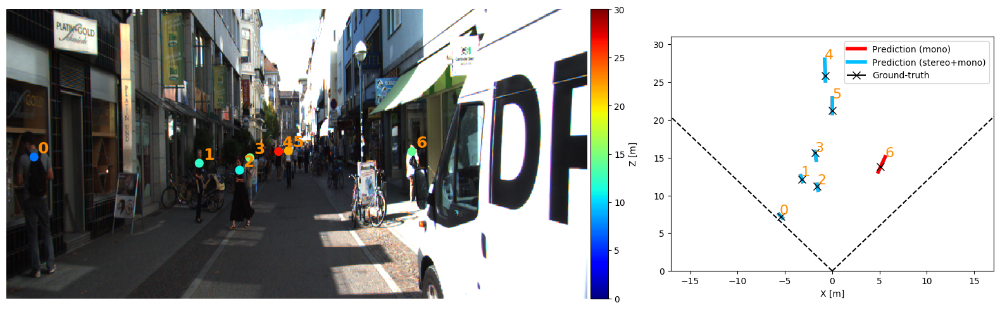

# MonStereo


 > Monocular and stereo vision are cost-effective solutions for 3D human localization 
 in the context of self-driving cars or social robots. However, they are usually developed independently 
 and have their respective strengths and limitations. We propose a novel unified learning framework that 
 leverages the strengths of both monocular and stereo cues for 3D human localization. 
 Our method jointly (i) associates humans in left-right images, 
 (ii) deals with occluded and distant cases in stereo settings by relying on the robustness of monocular cues, 
 and (iii) tackles the intrinsic ambiguity of monocular perspective projection by exploiting prior knowledge 
 of human height distribution.
We achieve state-of-the-art quantitative results for the 3D localization task on KITTI dataset 
and estimate confidence intervals that account for challenging instances. 
We show qualitative examples for the long tail challenges such as occluded, 
far-away, and children instances. 

```
@InProceedings{bertoni_monstereo,
author = {Bertoni, Lorenzo and Kreiss, Sven and Mordan, Taylor and Alahi, Alexandre},
title = {MonStereo: When Monocular and Stereo Meet at the Tail of 3D Human Localization},
booktitle = {arXiv:2008.10913},
month = {August},
year = {2020}
}
```

# Features
The code has been built upon the ICCV'19 project [MonoLoco](https://github.com/vita-epfl/monoloco).
This repository supports

* the original MonoLoco
* An improved Monocular version (MonoLoco++) for x,y,z coordinates, orientation, and dimensions
* MonStereo

# Setup

### Install
The installation has been tested on OSX and Linux operating systems, with Python 3.6 or Python 3.7. 
Packages have been installed with pip and virtual environments.
For quick installation, do not clone this repository, 
and make sure there is no folder named monstereo in your current directory.
A GPU is not required, yet highly recommended for real-time performances. 
MonStereo can be installed as a package, by:

```
pip3 install monstereo
```

For development of the monstereo source code itself, you need to clone this repository and then:
```
pip3 install sdist
cd monstereo
python3 setup.py sdist bdist_wheel
pip3 install -e .
```

### Data structure

    Data         
    ├── arrays                 
    ├── models
    ├── kitti
    ├── logs
    ├── output
    

Run the following to create the folders:
```
mkdir data
cd data
mkdir arrays models kitti logs output
```

### Pre-trained Models
* Download Monstereo pre-trained model from 
[Google Drive](https://drive.google.com/drive/folders/1jZToVMBEZQMdLB5BAIq2CdCLP5kzNo9t?usp=sharing),
and save them in `data/models` 
(default) or in any folder and call it through the command line option `--model <model path>`
* Pifpaf pre-trained model will be automatically downloaded at the first run. 
Three standard, pretrained models are available when using the command line option 
`--checkpoint resnet50`, `--checkpoint resnet101` and `--checkpoint resnet152`.
Alternatively, you can download a Pifpaf pre-trained model from [openpifpaf](https://github.com/vita-epfl/openpifpaf)
 and call it with `--checkpoint  <pifpaf model path>`. All experiments have been run with v0.8 of pifpaf.
  If you'd like to use an updated version, we suggest to re-train the MonStereo model as well.
* The model for the experiments is provided in *data/models/ms-200710-1511.pkl*

# Interfaces
All the commands are run through a main file called `main.py` using subparsers.
To check all the commands for the parser and the subparsers (including openpifpaf ones) run:

* `python3 -m monstereo.run --help`
* `python3 -m monstereo.run predict --help`
* `python3 -m monstereo.run train --help`
* `python3 -m monstereo.run eval --help`
* `python3 -m monstereo.run prep --help`

or check the file `monstereo/run.py`
              
# Prediction
The predict script receives an image (or an entire folder using glob expressions), 
calls PifPaf for 2d human pose detection over the image
and runs MonStereo for 3d location of the detected poses.


Output options include json files and/or visualization of the predictions on the image in *frontal mode*, 
*birds-eye-view mode* or *multi mode* and can be specified with `--output_types`


### Ground truth matching
* In case you provide a ground-truth json file to compare the predictions of MonSter,
 the script will match every detection using Intersection over Union metric. 
 The ground truth file can be generated using the subparser `prep` and called with the command `--path_gt`. 
As this step requires running the pose detector over all the training images and save the annotations, we 
provide the resulting json file for the category *pedestrians* from 
[Google Drive](https://drive.google.com/file/d/1e-wXTO460ip_Je2NdXojxrOrJ-Oirlgh/view?usp=sharing) 
and save it into `data/arrays`.
 
* In case the ground-truth json file is not available, with the command `--show_all`, is possible to 
show all the prediction for the image

After downloading model and ground-truth file, a demo can be tested with the following commands:

`python3 -m monstereo.run predict --glob docs/000840*.png --output_types multi --scale 2
 --model data/models/ms-200710-1511.pkl --z_max 30 --checkpoint resnet152 --path_gt data/arrays/names-kitti-200615-1022.json
 -o data/output`
 


`python3 -m monstereo.run predict --glob docs/005523*.png --output_types multi --scale 2
 --model data/models/ms-200710-1511.pkl --z_max 30 --checkpoint resnet152 --path_gt data/arrays/names-kitti-200615-1022.json
 -o data/output`


# Preprocessing
Preprocessing and training step are already fully supported by the code provided, 
but require first to run a pose detector over
all the training images and collect the annotations. 
The code supports this option (by running the predict script and using `--mode pifpaf`).


### Datasets
Download KITTI ground truth files and camera calibration matrices for training
from [here](http://www.cvlibs.net/datasets/kitti/eval_object.php?obj_benchmark=3d) and
save them respectively into `data/kitti/gt` and `data/kitti/calib`. 
To extract pifpaf joints, you also need to download training images soft link the folder in `
data/kitti/images`


### Annotations to preprocess
MonStereo is trained using 2D human pose joints. To create them run pifaf over KITTI training images. 
You can create them running the predict script and using `--mode pifpaf`.

### Inputs joints for training
MonoStereo is trained using 2D human pose joints matched with the ground truth location provided by
KITTI Dataset. To create the joints run: `python3 -m monstereo.run prep` specifying:
1. `--dir_ann` annotation directory containing Pifpaf joints of KITTI. 


### Ground truth file for evaluation
The preprocessing script also outputs a second json file called **names-<date-time>.json** which provide a dictionary indexed
by the image name to easily access ground truth files for evaluation and prediction purposes.


# Training
Provide the json file containing the preprocess joints as argument. 
As simple as `python3 -m monstereo.run train --joints <json file path>`
All the hyperparameters options can be checked at `python3 -m monstereo.run train --help`.

# Evaluation (KITTI Dataset)
### Average Localization Metric (ALE)
We provide evaluation on KITTI in the eval section. Txt files for MonStereo are generated with the command:

`python -m monstereo.run eval --dir_ann <directory of pifpaf annotations> --model data/models/ms-200710-1511.pkl  --generate`

### Relative Average Precision Localization (RALP-5%)
We modified the original C++ evaluation of KITTI to make it relative to distance. We use **cmake**.
To run the evaluation, first generate the txt files with:

`python -m monstereo.run eval --dir_ann <directory of pifpaf annotations> --model data/models/ms-200710-1511.pkl  --generate`

Then follow the instructions of this [repository](https://github.com/cguindel/eval_kitti) 
to prepare the folders accordingly (or follow kitti guidelines) and run evaluation. 
The modified file is called *evaluate_object.cpp* and runs exactly as the original kitti evaluation.
