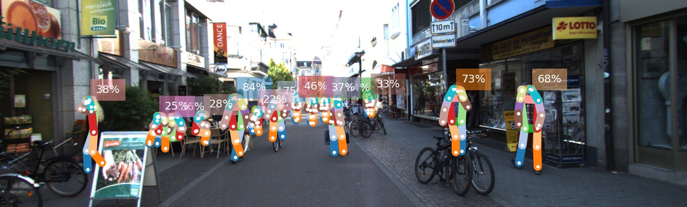

# Perceiving Humans: from Monocular 3D Localization to Social Distancing

> Perceiving humans in the context of Intelligent Transportation Systems (ITS) 
often relies on multiple cameras or expensive LiDAR sensors. 
In this work, we present a new cost- effective vision-based method that perceives humans’ locations in 3D 
and their body orientation from a single image.
We address the challenges related to the ill-posed monocular 3D tasks by proposing a deep learning method 
that predicts confidence intervals in contrast to point estimates. Our neural network architecture estimates 
humans 3D body locations and their orientation with a measure of uncertainty. 
Our vision-based system (i) is privacy-safe, (ii) works with any fixed or moving cameras,
 and (iii) does not rely on ground plane estimation. 
 We demonstrate the performance of our method with respect to three applications: 
 locating humans in 3D, detecting social interactions, 
 and verifying the compliance of recent safety measures due to the COVID-19 outbreak. 
 Indeed, we show that we can rethink the concept of “social distancing” as a form of social interaction 
 in contrast to a simple location-based rule. We publicly share the source code towards an open science mission.

```
@InProceedings{bertoni_social,
author = {Bertoni, Lorenzo and Kreiss, Sven and Alahi, Alexandre},
title={Perceiving Humans: from Monocular 3D Localization to Social Distancing}, 
booktitle = {arXiv:2009.00984},
month = {September},
year = {2020}
}
```


##  Predictions
For a quick setup download a pifpaf and a MonoLoco++ models from 
[here](https://drive.google.com/drive/folders/1jZToVMBEZQMdLB5BAIq2CdCLP5kzNo9t?usp=sharing)  and save them into `data/models`.

### 3D Localization
The predict script receives an image (or an entire folder using glob expressions), 
calls PifPaf for 2d human pose detection over the image
and runs Monoloco++ for 3d location of the detected poses.
The command `--net` defines if saving pifpaf outputs, MonoLoco++ outputs or MonStereo ones.
You can check all commands for Pifpaf at [openpifpaf](https://github.com/vita-epfl/openpifpaf).

Output options include json files and/or visualization of the predictions on the image in *frontal mode*, 
*birds-eye-view mode* or *combined mode* and can be specified with `--output_types`

Ground-truth KITTI files for comparing results can be downloaded from 
[here](https://drive.google.com/drive/folders/1jZToVMBEZQMdLB5BAIq2CdCLP5kzNo9t?usp=sharing) 
(file called *names-kitti*) and should be saved into `data/arrays`
Ground-truth files can also be generated, more info in the preprocessing section.

For an example image, run the following command:

```
python -m monstereo.run predict \
docs/002282.png \
--net monoloco_pp \
--output_types multi \
--model data/models/monoloco_pp-201203-1424.pkl \
--path_gt data/arrays/names-kitti-200615-1022.json \
-o <output directory> \
--long-edge <rescale the image by providing dimension of long side. If None original resolution>
--n_dropout <50 to include epistemic uncertainty, 0 otherwise>
```


To show all the instances estimated by MonoLoco add the argument `show_all` to the above command.


It is also possible to run [openpifpaf](https://github.com/vita-epfl/openpifpaf) directly
by specifying the network with the argument `--net pifpaf`. All pifpaf arguments are supported.



### Social Distancing
To visualize social distancing compliance, simply add the argument `--social-distance` to the predict command.

An example from the Collective Activity Dataset is provided below.


To visualize social distancing run the below, command:
```
python -m monstereo.run predict \
docs/frame0038.jpg \
--net monoloco_pp  \
--social_distance \
--output_types front bird --show_all \
--model data/models/monoloco_pp-201203-1424.pkl -o <output directory> 
```


Threshold distance and radii (for F-formations) can be set using `--threshold-dist` and `--radii`, respectively.

For more info, run:

`python -m monstereo.run predict --help`

### Orientation and Bounding Box dimensions
MonoLoco++ estimates orientation and box dimensions as well. Results are saved in a json file when using the command 
`--output_types json`. At the moment, the only visualization including orientation is the social distancing one.

## Preprocessing

### Kitti
Annotations from a pose detector needs to be stored in a folder.
For example by using [openpifpaf](https://github.com/vita-epfl/openpifpaf):
```
python -m openpifpaf.predict \
--glob "<kitti images directory>/*.png" \
--json-output <directory to contain predictions> 
--checkpoint=shufflenetv2k30 \
--instance-threshold=0.05 --seed-threshold 0.05 --force-complete-pose 
```
Once the step is complete:
`python -m monstereo.run prep --dir_ann <directory that contains predictions> --monocular`


### Collective Activity Dataset
To evaluate on of the [collective activity dataset](http://vhosts.eecs.umich.edu/vision//activity-dataset.html)
 (without any training) we selected 6 scenes that contain people talking to each other. 
 This allows for a balanced dataset, but any other configuration will work. 

THe expected structure for the dataset is the following:

    collective_activity         
    ├── images                 
    ├── annotations
    
where images and annotations inside have the following name convention:

IMAGES: seq<sequence_name>_frame<frame_name>.jpg
ANNOTATIONS: seq<sequence_name>_annotations.txt

With respect to the original datasets the images and annotations are moved to a single folder 
and the sequence is added in their name. One command to do this is:

`rename -v -n 's/frame/seq14_frame/'  f*.jpg`

which for example change the name of all the jpg images in that folder adding the sequence number
 (remove `-n` after checking it works)

Pifpaf annotations should also be saved in a single folder and can be created with:

```
python -m openpifpaf.predict \
--glob "data/collective_activity/images/*.jpg"  \
--checkpoint=shufflenetv2k30 \
--instance-threshold=0.05 --seed-threshold 0.05 --force-complete-pose\
--json-output /data/lorenzo-data/annotations/collective_activity/v012 
```

Finally, to evaluate activity using a MonoLoco++ pre-trained model trained either on nuSCENES or KITTI:
```
python -m monstereo.run eval --activity \ 
--net monoloco_pp --dataset collective \
--model <MonoLoco++ model path>  --dir_ann <pifpaf annotations directory>
```

## Training
We train on KITTI or nuScenes dataset specifying the path of the input joints.

Our results are obtained with: 

`python -m monstereo.run train --lr 0.001 --joints data/arrays/joints-kitti-201202-1743.json --save --monocular`

For a more extensive list of available parameters, run:

`python -m monstereo.run train --help`

## Evaluation

### 3D Localization
We provide evaluation on KITTI for models trained on nuScenes or KITTI. We compare them with other monocular 
and stereo Baselines: 

[MonoLoco](https://github.com/vita-epfl/monoloco), 
[Mono3D](https://www.cs.toronto.edu/~urtasun/publications/chen_etal_cvpr16.pdf), 
[3DOP](https://xiaozhichen.github.io/papers/nips15chen.pdf), 
[MonoDepth](https://arxiv.org/abs/1609.03677) 
[MonoPSR](https://github.com/kujason/monopsr) and our 
[MonoDIS](https://research.mapillary.com/img/publications/MonoDIS.pdf) and our 
[Geometrical Baseline](monoloco/eval/geom_baseline.py).

* **Mono3D**: download validation files from [here](http://3dimage.ee.tsinghua.edu.cn/cxz/mono3d) 
and save them into `data/kitti/m3d`
* **3DOP**: download validation files from [here](https://xiaozhichen.github.io/) 
and save them into `data/kitti/3dop`
* **MonoDepth**: compute an average depth for every instance using the following script 
[here](https://github.com/Parrotlife/pedestrianDepth-baseline/tree/master/MonoDepth-PyTorch) 
and save them into `data/kitti/monodepth`
* **GeometricalBaseline**: A geometrical baseline comparison is provided. 

The average geometrical value for comparison can be obtained running:
```
python -m monstereo.run eval 
--dir_ann <annotation directory> 
--model <model path> 
--net monoloco_pp 
--generate
````

To include also geometric baselines and MonoLoco, add the flag ``--baselines``


Adding the argument `save`, a few plots will be added including 3D localization error as a function of distance:


### Activity Estimation (Talking)
Please follow preprocessing steps for Collective activity dataset and run pifpaf over the dataset images.
Evaluation on this dataset is done with models trained on either KITTI or nuScenes. 
For optimal performances, we suggest the model trained on nuScenes teaser (TODO add link)
```
python -m monstereo.run eval 
--activity 
--dataset collective
--net monoloco_pp
--model <path to the model>   
--dir_ann <annotation directory>
```
